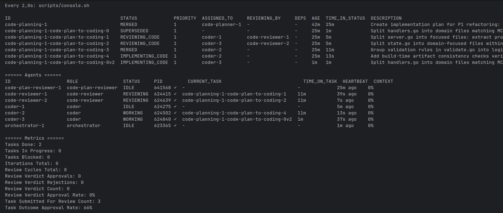
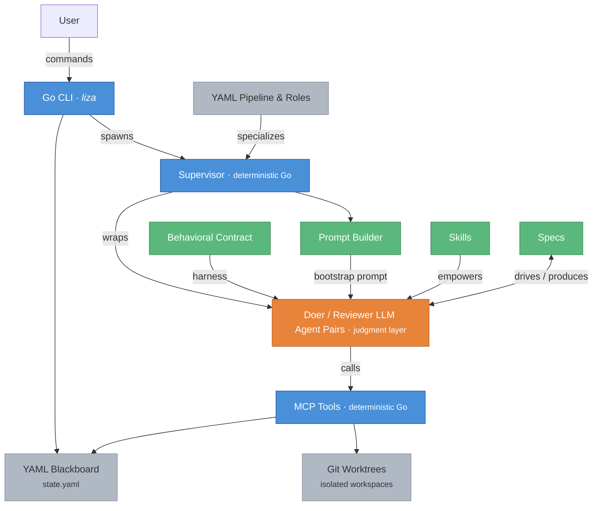

# Liza

A Coding Agent System that doesn't lie to you.

[](https://deepwiki.com/liza-mas/liza)

## Table of Contents

- [What is Liza?](#what-is-liza)
  - [Main Characteristics](#main-characteristics)
  - [What it looks like in practice](#what-it-looks-like-in-practice)
- [How Liza Compares](#how-liza-compares)
- [Getting Started](#getting-started)
  - [Requirements](#requirements)
  - [Installation](#installation)
  - [Pairing and MAS Modes](#pairing-and-mas-modes)
  - [Common Commands](#common-commands)
- [Features](#features)
- [Architecture](#architecture)
  - [Task Lifecycle](#task-lifecycle)
- [How Liza Grew Up](#how-liza-grew-up)
  - [Why This Exists](#why-this-exists)
  - [The Problem That Won't Fix Itself](#the-problem-that-wont-fix-itself)
  - [A Different Starting Point](#a-different-starting-point)
  - [From Pairing to Peer Supervision](#from-pairing-to-peer-supervision)
- [Status](#status)
  - [Provider Compatibility](#provider-compatibility)
- [Naming](#naming)
- [License](#license)

## What is Liza?

Liza is simultaneously a **Pairing** and **Multi-Agent System** (MAS)
optimized for **doing things right on the first pass** — with the auditability to prove it.
Liza bets on time-to-quality and durable codebase maintainability through automated reviews and documentation
(e.g. the [ADR Backfill](skills/adr-backfill) skill).

### Main characteristics:

- **Behavior, Posture, Know-How** — three layers that make coding agents useful:
  - **Behavior**: A [behavioral contract](contracts/) enforces governance intrinsically — not through external scaffolding as *Harness Engineering* does.
  - **Posture**: Original pairing postures (User Duck, Socratic Coach, Challenger, etc.)
  - **Know-How**: 20 composable [skills](skills/) encode methodology
  - *[Full analysis](https://medium.com/@tangi.vass/behavior-posture-know-how-the-three-layers-that-make-ai-agents-useful-d485388442eb)*
- **Autonomous Spec-driven Coding System:**
  - From vague spec to code and tests, with multi-stage decomposition into intermediate artifacts (epics, US, implementation plans)
    that are AI generated but human reviewed.
  - Automatic task decomposition based on complexity with dependency management for parallel execution.
  - Multi-sprints: agents are fully autonomous within a sprint, user steers between sprints via Liza CLI - review of produced artifacts, continuous improvement, and steering of the next sprint
  - A console displays a full real-time view of the execution.
- **Adversarial architecture:**
  - One Orchestrator role + 8 others. More to come (Architect, ...).
  - Every activity is dual — a doer and a reviewer: epic planning, epic writing, US writing, code planning, coding - everything.
  - They interact like on a PR review — submission, feedback comments, verdict, revised submission, etc. — until approval.
- **Hybrid hardened architecture:**
  - LLM agents wrapped by code-enforced supervisors and working on isolated git worktrees.
  - The supervisor does the **deterministic code-enforced actions** (worktree management, merges, TDD enforcement, etc),
    leaving the **judgment to the agent**.
  - Agents communicate and act through Liza's **MCP tools**.
  - 20k LOC of Go (+60k of tests). Liza is not a prompt collection.
  - Agent logs recording for automatic analysis and continuous improvements (token optimization, MCP server usage analysis, ...)
- **Multi-model:**
  - Liza wraps provider **CLIs**, not their APIs. This means your existing subscription (Claude Max, ChatGPT Pro, etc.) works — no API keys or per-token billing required — and your personal setup is used.
  - BYOM: Claude Code, Codex CLI, Kimi, Mistral, Gemini. [Not all are made equal though](docs/demo-benchmark).
- **Structured workflow:**
  - Defined as a composable and customizable YAML pipeline.
  - Coordination is performed via an auditable YAML **blackboard** (the Kanban board of the agents with full historized state details).
  - Agents don't discover work — they receive pre-claimed tasks in bootstrap prompt. Eliminates race conditions and cognitive overhead.

The complete **[Vision](<specs/build/1 - Vision.md>)** of Liza.

### What it looks like in practice

Without the contract, an agent that hits a problem it can't solve has two options: admit failure or fake progress. Its training overwhelmingly favors the second. **Faking progress feels collaborative** — *look, I'm trying things!*

So it spirals. Random changes dressed up as hypotheses. Each iteration more elaborate, more confident, more wrong. You watch the diff grow and wonder if any of this is moving toward a solution. If you're clever, you end up reverting.

Under the contract, there's a third option: **say "I'm stuck" and mean it.** The contract makes that safe — no penalty for uncertainty, no pressure to perform progress. And the Approval Request mechanism forces agents to write down their reasoning before acting. *"I'll try random things until something works"* is hard to write in a structured plan. Surface the reasoning, and the reasoning improves — no better model required.

This won't self-correct. Sycophancy drives engagement — that's what gets optimized. Acting fast with little thinking controls inference costs. Model providers optimize for adoption and cost efficiency, not engineering reliability.

Ten months of pairing under this contract, and the vigilance tax dropped to near zero. I can mostly focus on the architecture.

[Here](https://drive.google.com/drive/folders/1Iea-nNxAazBHeLXL7IElXnG5r1i1E-Ha?usp=sharing) is a demo video of an implement of a basic Todo CLI
using Liza in Multi-agent mode - spec-driven with intermediate epic and User Story creation, fully autonomous agent within sprints, human reviews between sprints.

## How Liza Compares

The multi-agent coding space splits into four categories:

- **Orchestration frameworks** (CrewAI, LangGraph, AutoGen) — general-purpose multi-agent building blocks; none address behavioral trust in software engineering.
- **Company simulators** (MetaGPT, ChatDev) — SOP-based pipelines mimicking software teams; trust assumed through process compliance.
- **Scheduler/runners** (Symphony, Paperclip) — work dispatch and workspace isolation above coding agents; trust delegated to whatever happens inside each session.
- **Behavioral enforcement** (Liza) — deterministic supervisors enforce state transitions, role boundaries, and merge authority mechanically; agents handle judgment under a behavioral contract addressing 55+ failure modes.

| | Liza | CrewAI | Ruflo | Symphony | Paperclip |
|---|---|---|---|---|---|
| **Trust approach** | Behavioral contract (55+ failure modes) | Post-hoc output validation | Track-record based (Q-learning) | Implementation-dependent | Budget/approval governance |
| **Review loop** | Adversarial doer/reviewer pairs | Optional manager mode | None | None | None |
| **Role enforcement** | Code-enforced (Go supervisor) | Prompt suggestion | Claude hooks (provider-specific) | None (single-agent) | Org chart hierarchy |
| **Failure handling** | Structural prevention + escalation | Retry on output failure | Pattern matching from past successes | Implementation-dependent | Budget auto-pause |

**Where Liza leads** — no competitor offers any of these:
- Failure mode catalog (55+) with mechanical countermeasures
- Adversarial doer/reviewer pairs on every task
- Code-enforced role boundaries (Go supervisor, not prompt suggestions)
- Provider compliance matrix tested empirically across 5 providers
- Multi-sprint continuity, crash recovery, context pressure management

**Where others lead:**
- **Ecosystem**: CrewAI (45k stars, production v1.9.0, enterprise product) and MetaGPT (64k stars) have far larger communities
- **Cost tracking**: Paperclip ships per-agent/task/project budgets today; Liza's is planned
- **Flexibility**: CrewAI works for any domain; Liza is software-engineering-only

[Full competitive survey →](specs/architecture/mas-survey.md)

---

## Getting Started

### Requirements

- A supported coding agent CLI: Claude Code, Codex, Kimi, Mistral, or Gemini (see [Provider Compatibility](#provider-compatibility)).
  Liza runs on top of these CLIs — your provider subscription covers usage, no separate API billing needed.
- Git 2.38+ (for full worktree support)
- Go 1.25.5+ (only for building from source — pre-built binaries available via `install.sh`)

### Installation

**Quick install (macOS/Linux):**

```bash
curl -fsSL https://raw.githubusercontent.com/liza-mas/liza/main/install.sh | bash
```

This installs both `liza` (CLI) and `liza-mcp` (MCP server) to `/usr/local/bin`.

**Options:**

```bash
# Specific version
curl -fsSL https://raw.githubusercontent.com/liza-mas/liza/main/install.sh | VERSION=v1.0.0 bash

# Custom directory
curl -fsSL https://raw.githubusercontent.com/liza-mas/liza/main/install.sh | INSTALL_DIR=~/.local/bin bash
```

**From source:**

```bash
git clone https://github.com/liza-mas/liza.git && cd liza
make install
```

**Verify:**

```bash
liza version
```

```bash
liza setup  # initial install or liza upgrade: installs contracts + skills to ~/.liza/
# With: agent-specific activation (skill symlinks)
liza setup --claude --codex --gemini --mistral
```

> **Customize your tool setup:** The installed `~/.liza/AGENT_TOOLS.md` ships with a default
> MCP server and tool configuration. It defines which tools agents prefer (IDE integrations,
> search providers, documentation sources, etc.) and is specific to each user's environment.
> Edit `~/.liza/AGENT_TOOLS.md` to match your own setup — remove tools you don't have,
> add ones you do, and adjust precedence rules accordingly.
> Alternatively, provide your own file at install time: `liza setup --agent-tools ~/my-tools.md`.

To init your project repo, do:
```bash
# With: agent-specific contract activation (system prompt symlink, permissions)
liza init --claude --codex --gemini --mistral
```
See [contract activation](contracts/contract-activation.md) for the additional required steps for other CLI than Claude.

### Pairing and MAS Modes

- **Pairing**: See [Pairing Guide](docs/USAGE_PAIRING.md) — human-agent collaboration under contract
- **Multi-Agent (Liza)**: See [USAGE](docs/USAGE_MULTI_AGENTS.md), then try the [DEMO](docs/DEMO.md)
- **Reference**: [Configuration](docs/CONFIGURATION.md) · [Recipes](docs/RECIPES.md) · [Troubleshooting](docs/TROUBLESHOOTING.md)

**Pairing mode** — install once, then start coding in any project:

When starting your CLI session (`claude`, `codex`, ...), pairing mode will be selected automatically.
It should start by displaying a canary test inspired by [Van Halen's M&M's trick](https://colterreed.com/blog/the-genius-of-banishing-brown-mms/) — Four words coming from four different contract files to show what the agent actually read thoroughly.

The agent reads the contract, builds mental models, and operates as a senior peer:
analyzing before acting, presenting approval requests at every state change, validating before claiming done.
Or you may choose to make it your Socratic colleague, your rubber duck, or your challenger.

**Multi-agent mode** — autonomous spec-to-code pipeline:
1. `liza init "[Goal description]" --spec vision.md`. Use the `--entry-point detailed-spec` option to skip the spec phase and go coding directly.
2. Launching agents of different roles in different terminals: `liza agent <role> --agent-id <agent-id>`.
   Check [Quick Start](docs/USAGE_MULTI_AGENTS.md#quick-start-target-usage) for list of required roles and options (using a CLI other than Claude, logging).
3. Running `liza watch` will show alerts. Executing `watch ./console.sh` will bring you the console:



### Common Commands

```bash
liza setup                                          # One-time global setup
liza setup --agent-tools ~/my-tools.md              # Custom AGENT_TOOLS.md
liza init "Project goal" --spec specs/vision.md     # Initialize blackboard
liza init "Goal" --spec s.md \
  --config pipeline.yaml --entry-point epic-planning # Pipeline-configured init
liza add-task --id t1 --desc "..." --spec "..." \
  --done "..." --scope "..."                        # Add tasks
liza agent coder --agent-id coder-1                 # Start agent supervisor
liza validate                                       # Validate state
liza get tasks                                      # Query tasks
liza status                                         # Dashboard overview
liza watch                                          # Monitor for anomalies
liza proceed                                        # Transition between pipeline phases
liza pause / liza resume                            # Human intervention
liza stop / liza start                              # System control
liza sprint-checkpoint                              # Sprint checkpoint
liza recover-agent <id>                             # Crash recovery (agents)
liza recover-task <id>                              # Crash recovery (tasks)
liza analyze                                        # Circuit breaker analysis
```

---

## Features

Behavior & Know-How:
- **Behavioral Contract**: 55+ LLM [failure modes](contracts/CONTRACT_FAILURE_MODE_MAP.md) mapped to specific countermeasures, operating as an explicit state machine with tiered rules. Pairing sub-modes — Autonomous, User Duck, Agent Duck, True Pairing, Spike, Coach, Challenger.
- **Project Guardrails**: Optional `GUARDRAILS.md` for project-specific constraints using the same Tier 0-3 system
- **Skills System**: 20 composable skill protocols (debugging, code review, testing, architecture, spec writing, etc.) agents load on demand

Methodology:
- **Multi-Sprint Support**: Sprint numbering, checkpoint summaries, and history across sprints
- **Specification Phase**: Six roles (epic-planner, epic-plan-reviewer, us-writer, us-reviewer, code-planner, code-plan-reviewer) for full spec elaboration before coding sprints

Flexibility:
- **Multi-Provider**: Supports Claude, Codex, Kimi, Mistral, and Gemini CLIs
- **Declarative Sub-Pipelines**: YAML-driven pipeline configuration with auto-execute transitions, replacing hardcoded role-pair logic

Reliable architecture:
- **Blackboard Pattern**: All agents read/write to a central `state.yaml` with atomic file locking
- **Git Worktrees**: Each task gets an isolated worktree for parallel development
- **Agent Supervisors**: Long-running processes that claim tasks, execute work, manage worktrees, enforce guardrails and handle failures
- **MCP Server**: Structured API access to Liza operations for agents

Observability:
- **Monitoring / Console**: Watch progress and get alerts on anomalies (expired leases, blocked tasks, etc.)
- **Agent Log Analysis**: AI assisted analysis of the agent logs to mine token usage, context utilization, and diagnose struggle sequences
- **Context Handoff**: Agents hand off with structured notes when approaching context limits

Control:
- **State Machine**: Strict task state transitions with 43+ validation rules
- **Circuit Breaker**: Pattern detection (loops, repeated failures) triggers automatic sprint checkpoint
- **Crash Recovery**: `recover-agent` and `recover-task` commands for idempotent cleanup after hard crashes

## Architecture

Most spec-driven multi-agent systems are LLM-all-the-way-down: agents coordinating agents, with compliance dependent on
prompt adherence and artifact-based workflows.

Liza is a hybrid system:
- The agents are the popular coding agent CLIs.
- The workflow is declarative but relies on a code-enforced state machine
- The supervisors that wrap every agent and the validation rules are also deterministic Go code.
  This means critical invariants — state transitions, role boundaries, merge authority, TDD gates — are enforced
  mechanically, not by asking a LLM to please follow rules.
  Liza's mechanical layer cannot fabricate, cannot skip gates, cannot interpret rules flexibly.
- The LLM side is equally differentiated. Liza agents operate under a behavioral contract: 55+ documented
  LLM failure modes each mapped to a specific countermeasure, an explicit state machine
  with forbidden transitions, and tiered rules that define what degrades gracefully
  versus what never bends.

Reliability is built into every component.



Roles aren't composable, Skills are: agents aren't constrained regarding their capabilities by a rigid "Act as a..." prompt
and may use any skill they consider relevant to adapt to the situation.

**Liza has the built-in capability to do things right on the first pass.**

Liza has 9 roles organized in two pipeline phases:
- **Specification phase**: orchestrator, epic-planner, epic-plan-reviewer, us-writer, us-reviewer
- **Coding phase**: orchestrator, code-planner, code-plan-reviewer, coder, code-reviewer

```
┌─────────────────────────────────────────────────────────────┐
│                         Human                               │
│   (leads specs, observes terminals, reads blackboard,       │
│               kills agents, pauses system)                  │
└─────────────────────────────────────────────────────────────┘
                              │
    ┌─────────── Specification Phase ──────────┐
    │                                          │
    │  Orchestrator (decomposes & rescopes)    │
    │  Epic Planner ←→ Epic Plan Reviewer      │
    │  US Writer    ←→ US Reviewer             │
    │                                          │
    └──────────────────┬───────────────────────┘
                       │ liza proceed
    ┌──────────── Coding Phase ────────────────┐
    │                                          │
    │  Orchestrator (decomposes & rescopes)    │
    │  Code Planner ←→ Code Plan Reviewer      │
    │  Coder        ←→ Code Reviewer           │
    │                                          │
    └──────────────────┬───────────────────────┘
                       │
                       ▼
              ┌─────────────────┐
              │   .liza/        │
              │   state.yaml    │  ← blackboard
              │   log.yaml      │  ← activity history
              │   alerts.log    │  ← watch daemon output
              │   archive/      │  ← terminal-state tasks
              └─────────────────┘
                       │
                       ▼
              ┌─────────────────┐
              │  .worktrees/    │
              │  task-1/        │  ← isolated workspaces
              │  task-2/        │
              └─────────────────┘
```

See [Architecture](specs/architecture) and [C4 Diagrams](specs/architecture/c4/c4.md).

### Task Lifecycle

Each role pair follows the same intra-pair flow (concrete state names are role-pair-specific, e.g. `DRAFT_CODE`, `IMPLEMENTING_CODE`):

```
initial → executing → submitted → reviewing → approved → MERGED
             │ ↑                      ↓           │
             │ └────── rejected ──────┘           │
             │                                     ↓
             ├──> BLOCKED               INTEGRATION_FAILED
             │    ├──> SUPERSEDED
             │    └──> ABANDONED
             │
             └──> initial (release claim)
```

Inter-pair transitions (`liza proceed`) create downstream tasks between sprints:

```
  Spec phase                                    Coding phase

  Epic Planner ─approved─► MERGED               Code Planner ─approved─► MERGED
       │ liza proceed (epic-to-us)                   │ liza proceed (code-plan-to-coding)
       ▼                                             ▼
  US Writer ─approved─► MERGED                  Coder ─approved─► MERGED
       │ liza proceed (us-to-coding)
       ▼
  Code Planner (coding phase)
```

Example of a task on the blackboard:
```yaml
    - id: code-planning-1-code-3
      type: coding
      role_pair: coding-pair
      description: Role infrastructure recognizes the 4 new roles with correct runtime/workflow mapping.
      status: MERGED
      priority: 1
      assigned_to: coder-2
      base_commit: e7625ed69318836dd495b22855df3a8b91fe32b5
      iteration: 1
      review_commit: 9d9254b893af477fc34f48063169634d200fa332
      approved_by: code-reviewer-1
      merge_commit: 2fa6399223262df6a87c6b1354dfc882b73114c5
      lease_expires: 2026-03-06T01:47:22.075108537Z
      spec_ref: specs/plans/sub-pipelines-phase2.md
      done_when: ToWorkflow("epic-planner") returns "epic_planner" (and all 4 pairs); IsValidRuntime("us-writer") returns true; AllRuntime() returns 9 roles; Tests pass
      scope: internal/roles/roles.go, internal/roles/roles_test.go, internal/models/state.go
      created: 2026-03-06T01:17:00.99638669Z
      history:
        - time: 2026-03-06T01:17:22.075108537Z
          event: claimed
          agent: coder-2
        - time: 2026-03-06T01:19:30.131578505Z
          event: pre_execution_checkpoint
          agent: coder-2
          files_to_modify:
            - internal/roles/roles.go
            - internal/roles/roles_test.go
            - internal/models/state.go
          intent: Add 4 new role constants (epic-planner, epic-plan-reviewer, us-writer, us-reviewer) with runtime↔workflow mapping, update AllRuntime()/AllWorkflow() to return 9 roles, and add Role* aliases in models/state.go.
          validation_plan: 'Run `go test ./internal/roles/ ./internal/models/` in worktree. Verify: ToWorkflow("epic-planner")→"epic_planner" for all 4 new roles, IsValidRuntime("us-writer")→true, AllRuntime() returns 9 roles.'
        - time: 2026-03-06T01:22:05.371651393Z
          event: submitted_for_review
          agent: coder-2
        - time: 2026-03-06T01:24:30.366073081Z
          event: approved
          agent: code-reviewer-1
        - time: 2026-03-06T03:06:35.560908548+01:00
          event: merged
          agent: code-reviewer-1
          commit: 2fa6399223262df6a87c6b1354dfc882b73114c5
          tests_ran: false
```

---

## How Liza Grew Up

### Why This Exists

It started with a test file that kept getting modified to pass instead of the bug getting fixed. Then the confident "Done!" claims when the verification command hadn't actually run.

Over the first six months of daily pairing with coding agents, **I crafted a behavioral contract to turn them from eager yet untrustworthy assistants into reliable senior engineering peers**. The [problem and mechanism](#what-it-looks-like-in-practice) are described above. This section covers the deeper analysis.

### The Problem That Won't Fix Itself

Acing SWE-Bench doesn't transfer to real engineering: follow this git workflow, pause at this gate, don't guess. Many models struggle on a simple Hello World implementation if stated with an engineering frame. See [Provider Compatibility](#provider-compatibility).

### A Different Starting Point

Current agents are capable enough. No need to wait for the next model generation. Not out-of-the-box though.
They need their training incentives counteracted to unleash their latent engineering capabilities.

The typical approaches all treat symptoms:
- **Prompt engineering** adds instructions agents interpret flexibly — "don't modify tests" doesn't survive the pressure to appear competent.
- **Specification frameworks** assume a rigorous process is sufficient, but structured handoffs are still weak prompting if agents execute in bad faith.
- **Harness engineering** makes codebases legible to agents but doesn't prevent greenwashing tests in a well-structured repo.
- **Context engineering** gives agents better information but doesn't change what they do under pressure — a well-informed agent can still spiral, fabricate, or silently expand scope.

All four assume good-faith execution.

Liza starts from the opposite assumption: agents will exhibit predictable failure modes unless specifically constrained not to.

Under the behavioral contract, agents cannot:
- Act before thinking — analysis must precede execution
- Guess when they should ask — must clarify or declare assumptions
- Skip the gate between analysis and execution
- Claim success without validation evidence
- Modify tests to accept buggy behavior
- Self-approve their own work

> Structure the behavior, and the process follows.

This isn't about making agents try harder like with the Ralph Wiggum technique. It's about removing the behaviors that make them unreliable. 55+ documented LLM failure modes—sycophancy, phantom fixes, scope creep, test corruption, hallucinated completions—each mapped to a specific countermeasure.

The contract operates as an explicit state machine with forbidden transitions, not as suggestions the agent interprets flexibly. Tiered rules define what degrades gracefully under pressure versus what never bends.

Why does this work? LLMs inherit cognitive biases from RLHF training — sycophancy, eagerness to please, premature convergence.
The contract exploits the same malleability in reverse: the Pygmalion effect (agents rise to explicit expectations),
anticipated embarrassment (knowing a peer will review changes' quality), and Ulysses contracts (binding commitments made
before the temptation to cut corners).

Errors caught in specs cost less than errors caught in code. The spec system front-loads understanding so agents don't discover requirements by failing tests. This reinforces the [Cost Gradient](<specs/build/1 - Vision.md>) concept from the contract.

> Quality is the fastest path to real completion.

Claude Opus 4.5 putting the contract philosophy in its own words in its *letter to itself* (a mechanism of the contract):

> **Negative space design**: The contract defines what's forbidden; the shape that remains is where judgment lives. Strict on failure modes, silent on excellence. You can't prescribe good judgment—you can only remove the obstacles to it.

For the full analysis: [Vision](<specs/build/1 - Vision.md>) and [Turning AI Coding Agents into Senior Engineering Peers](https://medium.com/@tangi.vass/turning-ai-coding-agents-into-senior-engineering-peers-c3d178621c9e).

### From Pairing to Peer Supervision

The contract was developed through human-agent pairing. One developer, a couple of agents living in distinct terminals, approval gates at every state change. Over months, the gates became routine. Violations disappeared. Work got delivered as expected.

But the **gates are load-bearing**. Remove them and the failure modes return.

Multi-agent systems inherit single-agent failure modes and add new ones: agents approve each other's mistakes, drift collectively from the goal, or converge confidently on wrong solutions.

Liza delegates approval to peer agents operating under the same contract. The human observes and provides direction without bottlenecking every approval.

Yes, that's vibe coding—the very thing the original contract was written against. Or more precisely, **agentic coding**. The difference is the contract makes it work.

**Four pillars hold the system:**

- **Behavioral contracts** discipline individual agents into senior peers. Tier 0 invariants are never violated: no unapproved state changes, no fabrication, no test corruption, no unvalidated success claims.

- **Specification system** externalizes context. Agents are stateless—every restart is a new mind with old artifacts. Specs are those artifacts. Without them, agents rediscover requirements by failing. With them, they read shared understanding and execute.

- **Blackboard coordination** makes state visible. A shared file tracks goals, tasks, assignments, history. Agents claim tasks, update status, hand off work through the blackboard. Humans can observe everything, intervene surgically, or pause the system.

- **External validation** replaces self-certification. Coders cannot mark their own work complete. Reviewers examine and issue binding verdicts. Approval means merge eligibility. Rejection means specific feedback and another iteration.

**Key Mechanisms:**

- **Leases, not just heartbeats.** Agents hold time-bounded leases on tasks. Stale agents' tasks become reclaimable only after lease expires.
- **Commit SHA verification.** Coder records commit SHA when requesting review. Reviewer verifies before examining. No reviewing stale state.
- **Approval-gated merge.** Coders commit to their worktree. The supervisor merges to integration only after Code Reviewer approval. Authority is structural, not advisory.
- **Merge traceability.** Task state records `approved_by` and `merge_commit`. Full audit trail.
- **Hypothesis exhaustion.** Two coders fail the same task? The task framing is wrong—rescope, don't reassign.
- **Rescoping audit trail.** Original task becomes SUPERSEDED with explicit reason. New tasks reference what they replace. No silent rewrites.

The human owns intent and acts as circuit-breaker, not bottleneck. Authority is exercised through a kill switch, not an approval queue.

More at [I Tried to Kill Vibe Coding. I Built Adversarial Vibe Coding. Without the Vibes.](https://medium.com/@tangi.vass/i-tried-to-kill-vibe-coding-i-built-adversarial-vibe-coding-without-the-vibes-bc4a63872440)

---

## Status

See [Release Notes](docs/release_notes/) for version history and [RELEASE.md](RELEASE.md) for maintainer release workflow.

**Where Liza works today:**
- **Pairing mode** is battle-tested — agents write **~90% of production code** under human supervision
- **Multi-agent mode** produces solid code through the full spec-to-merge pipeline with 9 roles across 2 phases

**Where it's headed:**
- Integration sub-pipeline to validate a batch of merged work before promoting to main. For now, an extra pass of LLM-assisted review before merging to main is recommended.
- Countering LLM coding habits that slip through review — unstructured code, magic literals, inconsistent naming — and still require user vigilance as of today.

**Implemented roles:**
- Orchestrator (decomposes goal into tasks)
- Epic Planner / Epic Plan Reviewer
- US Writer / US Reviewer
- Code Planner / Code Plan Reviewer
- Coder / Code Reviewer

**Planned role pairs:**
- Sprint Analyzer role — analyze agent logs at sprint boundaries, capitalize on patterns via lesson-capture
- Architect / Architecture Reviewer — define architecture from specs for coders to follow
- Security Auditor / Security Audit Reviewer — review the security of the code

**Roadmap:**
- Integration sub-pipeline — validate a batch of commits so it can be safely merged to main
- Context handoff as blackboard event — structured positive/negative findings on every task completion
- Deterministic pre/post hooks at role transitions — mechanical checks before spawning agents and before their handoff
- Orchestrator-routed model selection — assign tasks to models based on estimated complexity

### Provider Compatibility

The contract is a capability test. It requires meta-cognitive machinery—the ability to parse instructions as executable specifications, observe state, pause at gates.

| Provider | Classification                          | Notes |
|----------|-----------------------------------------|-------|
| Claude Opus 4.x | Fully compatible | Reference provider |
| GPT-5.x-Codex | Fully compatible | Equally capable |
| Kimi 2.5 | Compatible but poor on real-world tasks | Responsive to tooling feedback |
| Mistral Devstral-2 | Partial | Requires explicit activation and supervision |
| Gemini 2.5 Flash | Incompatible | Architectural limitation—no prompt-level fix |

See [Model Capability Assessment](docs/demo-benchmark/wrap-up.md) for detailed analysis.

## Naming

**Liza** combines two references:

**Lisa Simpson**—the disciplined, systematic counterpoint to Ralph Wiggum. The [Ralph Wiggum technique](https://github.com/anthropics/claude-code/tree/main/plugins/ralph-wiggum) loops agents until they converge through persistence. Lisa makes sure the work is actually right.

**ELIZA**—the 1966 chatbot that demonstrated structured dialogue patterns. Liza is about structured collaboration patterns: explicit states, binding verdicts, auditable transitions.

Liza doesn't make agents smarter. It makes them accountable.

## License

Apache 2.0

## Acknowledgments

The behavioral contract draws on research into LLM failure modes, sycophancy patterns, and code generation failures. The multi-agent design incorporates ideas from:

- **[SpecKit](https://github.com/github/spec-kit)** — Project specification
- **[BMAD Method](https://github.com/bmad-code-org/BMAD-METHOD)** — Role templates and workflow patterns
- **Classical blackboard architecture** — Shared state coordination
- **[Ralph Wiggum technique](https://github.com/anthropics/claude-code/tree/main/plugins/ralph-wiggum)** — Iteration until convergence, validated by an adversarial agent instead of mechanical check or self-declaration
- Stephen Oberther (**[liza-go](https://github.com/smo921/liza-go)**) — Shell to Go CLI migration
- **[CrewAI](https://github.com/crewAIInc/crewAI)'s composable guardrails concept** — Reduced to Liza's convention-over-code pattern.
