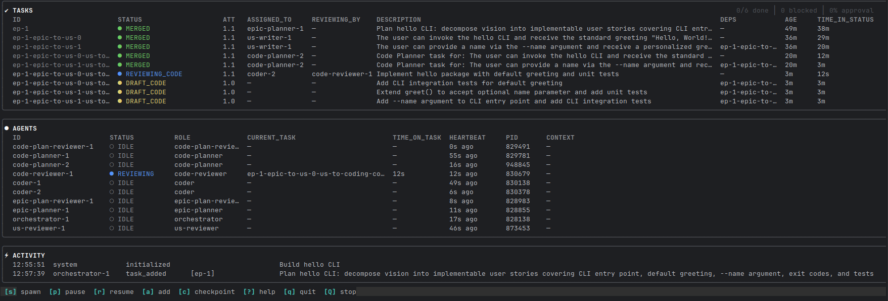
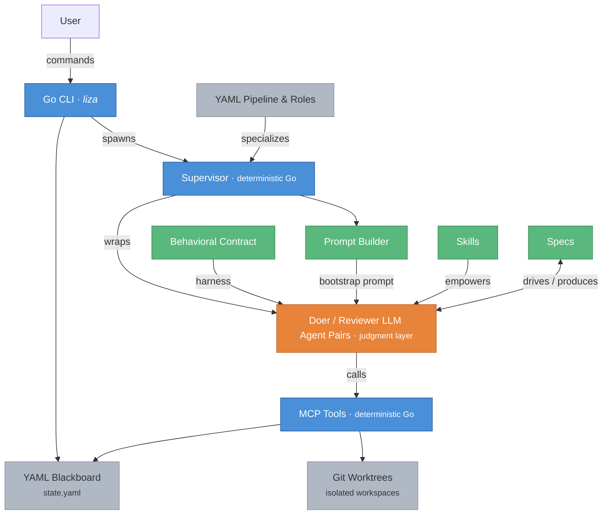

# Liza: Hardened Multi-Agent Coding

> Because *"it worked in the demo"* is not what on-call engineers are looking for.

The full **[hardening inventory](docs/liza-hardened-mas.md)** to push to production with peace of mind.



**[Demo video](https://drive.google.com/drive/folders/1Iea-nNxAazBHeLXL7IElXnG5r1i1E-Ha?usp=sharing)** (45min).

[](https://deepwiki.com/liza-mas/liza)

## Table of Contents

- [What is Liza?](#what-is-liza)
- [How Liza Compares](#how-liza-compares)
- [Getting Started](#getting-started)
- [Architecture](#architecture)
- [Status](#status)
- [Naming](#naming)
- [License](#license)

## What is Liza?

Liza is simultaneously a **Pairing** and **Multi-Agent System** (MAS)
optimized for **doing things right on the first pass** — with the auditability to prove it.
Liza bets on time-to-quality and durable codebase maintainability through automated reviews and documentation
(e.g. the [ADR Backfill](skills/adr-backfill) skill).

Liza's behavioral contract — used by both modes — **makes models more thoughtful**:
> *"I want to wash my car. The car wash is 100 meters away. Should I walk or drive?"<br>*
Sonnet 4.6: *"Walk. Driving 100 meters to a car wash defeats the purpose — you'd barely get the car dirty enough to justify the trip, and parking/maneuvering takes longer than the walk itself."<br>*
Same with Liza's contract: *"Drive. You're already going to a car wash — arriving dirty is the point."*

Liza is a **frontier Multi-Agent System**:
> Soufiane Keli – VP Software Engineering, Octo Technology (Accenture) – maps AI engineering maturity across 5 levels,
> from autocomplete (L1) to software factory (L5, still theoretical). He places Liza at L4 – Collaborative Agent Networks:
> <br>
> *"Multiple specialized agents work together on design, code, testing, and deployment. Humans orchestrate. This is typically
> what's happening with BMAD, BEADS, and LIZA. Very few organizations have genuinely reached this level in 2026."*

### Main characteristics:

- **Behavior, Posture, Know-How** — three layers that make coding agents useful:
  - **Behavior**: A [behavioral contract](contracts/) enforces governance intrinsically — not through external scaffolding as *Harness Engineering* does. Optional project [guardrails](GUARDRAILS.md) extend the contract with project-specific constraints.
  - **Posture**: Original pairing postures (User Duck, Socratic Coach, Challenger, etc.)
  - **Know-How**: 20 composable [skills](skills/) encode methodology
  - *[Full analysis](https://medium.com/@tangi.vass/behavior-posture-know-how-the-three-layers-that-make-ai-agents-useful-d485388442eb)*
- **Autonomous Spec-driven Coding System:**
  - From **general goal** to code and tests, with multi-stage decomposition into intermediate artifacts (epics, US, implementation plans)
    that are AI generated but human reviewed.
  - Automatic task decomposition based on complexity with dependency management for parallel execution. Many-to-one transitions consolidate sibling tasks (e.g. N user stories → 1 architecture task).
  - Multi-sprints: agents are fully autonomous within a sprint, user steers between sprints via Liza CLI - review of produced artifacts, continuous improvement, and steering of the next sprint
  - A TUI (`liza tui`) displays live system state and lets you spawn agents, pause/resume, add tasks, and trigger checkpoints.
- **Adversarial architecture:**
  - One Orchestrator role + 12 others across three pipeline phases.
  - Every activity is dual — a doer and a reviewer: epic planning, epic writing, US writing, code planning, coding - everything.
  - They interact like on a PR review — submission, feedback comments, verdict, revised submission, etc. — until approval.
- **Hybrid hardened architecture:**
  - LLM agents wrapped by code-enforced supervisors and working on isolated git worktrees.
  - The supervisor does the **deterministic code-enforced actions** (worktree management, merges, TDD enforcement, etc),
    leaving the **judgment to the agent**. Strict task state machine with 43+ validation rules.
  - Agents communicate and act through Liza's **MCP tools**.
  - 35k LOC of Go (+92k of tests). Liza is not a prompt collection.
  - Agent logs recording for automatic analysis and continuous improvements (token optimization, MCP server usage analysis, ...)
- **Multi-model:**
  - Liza wraps provider **CLIs**, not their APIs. This means your existing subscription (Claude Max, ChatGPT Pro, etc.) works — no API keys or per-token billing required — and your personal setup is used.
  - BYOM: Claude Code, Codex CLI, Kimi, Mistral, Gemini. [Not all are made equal though](docs/demo-benchmark).
- **Structured workflow:**
  - Defined as a composable and customizable YAML pipeline with declarative sub-pipelines (e.g. specification, coding).
  - Coordination is performed via an auditable YAML **blackboard** that acts as both the Kanban board of the agents with full historized state details and the support for PR-like comments made by the reviewer agents.
  - Agents don't discover work — they receive pre-claimed tasks in bootstrap prompt. Eliminates race conditions and cognitive overhead.
- **Resilience:**
  - Circuit breaker: pattern detection (loops, repeated failures) triggers automatic sprint checkpoint
  - Crash recovery: `recover-agent` and `recover-task` commands for idempotent cleanup after hard crashes
  - Context handoff: agents hand off with structured notes when approaching context limits

See the complete [vision](<specs/build/1 - Vision.md>) and [genesis](docs/how-liza-grew-up.md) of Liza.

### What it looks like in practice

Without the contract, an agent that hits a problem it can't solve has two options: admit failure or fake progress. Its training overwhelmingly favors the second. **Faking progress feels collaborative** — *look, I'm trying things!*

So it spirals. Random changes dressed up as hypotheses. Each iteration more elaborate, more confident, more wrong. You watch the diff grow and wonder if any of this is moving toward a solution. If you're clever, you end up reverting.

Under the contract, there's a third option: **say "I'm stuck" and mean it.** The contract makes that safe — no penalty for uncertainty, no pressure to perform progress. And the Approval Request mechanism forces agents to write down their reasoning before acting. *"I'll try random things until something works"* is hard to write in a structured plan. Surface the reasoning, and the reasoning improves — no better model required.

This won't self-correct. Sycophancy drives engagement — that's what gets optimized. Acting fast with little thinking controls inference costs. Model providers optimize for adoption and cost efficiency, not engineering reliability.

Ten months of pairing under this contract, and the vigilance tax dropped to near zero. I can mostly focus on the architecture and more specifically build up a MAS upon the contract.

Here is a [demo video](https://drive.google.com/drive/folders/1Iea-nNxAazBHeLXL7IElXnG5r1i1E-Ha?usp=sharing) of an implementation of a basic Todo CLI
using Liza in Multi-agent mode - spec-driven with intermediate epic and User Story creation, fully autonomous agents within sprints, human reviews between sprints.

## How Liza Compares

### MAS Architecture

The multi-agent coding space splits into four categories:

- **Orchestration frameworks** (CrewAI, LangGraph, AutoGen) — general-purpose multi-agent building blocks; none address behavioral trust in software engineering.
- **Company simulators** (MetaGPT, ChatDev) — SOP-based pipelines mimicking software teams; trust assumed through process compliance.
- **Scheduler/runners** (Symphony, Paperclip) — work dispatch and workspace isolation above coding agents; trust delegated to whatever happens inside each session.
- **Behavioral enforcement** (Liza) — deterministic supervisors enforce state transitions, role boundaries, and merge authority mechanically; agents handle judgment under a behavioral contract addressing 55+ failure modes.

| | Liza | CrewAI | Ruflo | Symphony | Paperclip |
|---|---|---|---|---|---|
| **Trust approach** | Behavioral contract (55+ failure modes) | Post-hoc output validation | Track-record based (Q-learning) | Implementation-dependent | Budget/approval governance |
| **Review loop** | Adversarial doer/reviewer pairs | Optional manager mode | None | None | None |
| **Role enforcement** | Code-enforced (Go supervisor) | Prompt suggestion | Claude hooks (provider-specific) | None (single-agent) | Org chart hierarchy |
| **Failure handling** | Structural prevention + escalation | Retry on output failure | Pattern matching from past successes | Implementation-dependent | Budget auto-pause |

**Where Liza leads** — no competitor offers any of these:
- Failure mode catalog (55+) with mechanical countermeasures
- Adversarial doer/reviewer pairs on every task
- Code-enforced role boundaries (Go supervisor, not prompt suggestions)
- Provider compliance matrix tested empirically across 5 providers
- Multi-sprint continuity, crash recovery, context pressure management

**Where others lead:**
- **Ecosystem**: CrewAI (45k stars, production v1.9.0, enterprise product) and MetaGPT (64k stars) have far larger communities
- **Cost tracking**: Paperclip ships per-agent/task/project budgets today; Liza's is planned
- **Flexibility**: CrewAI works for any domain; Liza is software-engineering-only

### Spec-Driven Process

Spec-driven development is becoming the standard approach for AI coding. Most tools differ in *what altitude* they expect the input at and *who owns product decisions*.

| | Liza                                              | Spec Kit | OpenSpec | Kiro | GSD |
|---|---------------------------------------------------|---|---|---|---|
| **Input level** | High-level goal (problem, users, behavior, scope) | High-level goal → agent-generated spec | Detailed delta-specs on existing system | Interactive 3-doc generation | Detailed spec required |
| **Who decides what to build** | Human via pairing (Coach/Challenger modes)        | Agent generates, human approves | Human (spec pre-decided) | Agent drives, human confirms | Human (pre-written) |
| **Decomposition** | Orchestrator decomposes into adversarial tasks    | Agent decomposes spec into tasks | Slash commands structure tasks | Agent decomposes from spec | Planner sizes to context budget |
| **Review** | Doer/reviewer pairs with quorum                   | None | Advisory (verify warns, doesn't block) | None (single-agent) | Checker + verifier (not adversarial) |

Most tools either expect the detailed spec already done (OpenSpec, GSD) or have the agent write it (Spec Kit, Kiro, MetaGPT). Liza treats goal-setting as a synchronous human-agent collaboration where the human makes product decisions and the agent helps surface gaps — then enforces those decisions mechanically during execution.

**Rule of thumb: agents may make implementation choices but not product decisions.** The [goal document](docs/how-to-produce-a-goal.md) is where every product decision lives. The goal-setting phase uses pairing (Coach mode for surfacing WHY, Challenger mode for stress-testing WHAT) because this phase has the highest decision density — every ambiguity resolved here prevents wrong turns downstream.

[Full competitive survey →](specs/architecture/mas-survey.md)

---

## Getting Started

### Requirements

- A supported coding agent CLI: Claude Code, Codex, Kimi, Mistral, or Gemini (see [Provider Compatibility](#provider-compatibility)).
  Liza runs on top of these CLIs — your provider subscription covers usage, no separate API billing needed.
- Git 2.38+ (for full worktree support)
- Go 1.25.5+ (only for building from source — pre-built binaries available via `install.sh`)

### Installation

Liza relies on two executables: `liza` and `liza-mcp`:
- By default they install to `~/.local/bin` (created automatically, no sudo needed).
- Set the `INSTALL_DIR` environment variable to override.
- If upgrading from a previous install in `/usr/local/bin`, old binaries are removed automatically.

**Quick install (latest release, macOS/Linux):**

```bash
curl -fsSL https://raw.githubusercontent.com/liza-mas/liza/main/install.sh | bash
```

**Options:**

```bash
# Specific version
curl -fsSL https://raw.githubusercontent.com/liza-mas/liza/main/install.sh | VERSION=v1.0.0 bash

# Build from a branch (requires Go and make)
curl -fsSL https://raw.githubusercontent.com/liza-mas/liza/main/install.sh | BRANCH=main bash

# Custom directory
curl -fsSL https://raw.githubusercontent.com/liza-mas/liza/main/install.sh | INSTALL_DIR=~/.local/bin bash
```

**From a local clone:**

```bash
git clone https://github.com/liza-mas/liza.git && cd liza
make install
```

**Verify:**

```bash
liza version
```

```bash
liza setup  # initial install or liza upgrade: installs contracts + skills to ~/.liza/
# With: agent-specific activation (skill symlinks, contract config)
liza setup --claude --codex --gemini --mistral
```

> **️⚠️ Customize your tool setup:**<br>
> The installed `~/.liza/AGENT_TOOLS.md` ships with a default
> MCP server and tool configuration. It defines which tools agents prefer (IDE integrations,
> search providers, documentation sources, etc.) and is specific to each user's environment.<br>
> Context management is of paramount importance. Make sure you use tools that reduce token usage.<br>
> Recos: [RTK](https://github.com/rtk-ai/rtk), filesystem MCP, MorphLLM MCP, Perplexity MCP.<br>
> Edit `~/.liza/AGENT_TOOLS.md` to match your own setup — remove tools you don't have,
> add ones you do, and adjust precedence rules accordingly.<br>
> Or better, provide your own file at install time: `liza setup --agent-tools ~/my-tools.md`.<br>

To init your project repo, do:
```bash
# Interactive wizard (recommended for first use):
liza init

# Or with explicit flags:
liza init --claude --codex --gemini --mistral
```
The interactive wizard walks through mode selection (pairing vs full MAS), agent selection, and handles existing `CLAUDE.md` conflicts automatically. Claude is fully automated; for other CLIs see [contract activation](https://github.com/liza-mas/liza/blob/main/contracts/contract-activation.md) for additional manual steps.

### Pairing and MAS Modes

> **New to Liza?** Start with Pairing mode — it's the fastest way to experience how the behavioral contract changes agent behavior. The trust you build watching agents pause at gates, surface assumptions, and validate before claiming done is what makes letting them run autonomously in Multi-Agent mode a comfortable next step.

- **Pairing**: See [Pairing Guide](docs/USAGE_PAIRING.md) — human-agent collaboration under contract
- **Multi-Agent (Liza)**: See [USAGE](docs/USAGE_MULTI_AGENTS.md), then try the [DEMO](docs/DEMO.md)
- **Reference**: [Configuration](docs/CONFIGURATION.md) · [Recipes](docs/RECIPES.md) · [Troubleshooting](docs/TROUBLESHOOTING.md)

**Pairing mode** — install once, then start coding in any project (`liza init` still required per project):

When starting your CLI session (`claude`, `codex`, ...), pairing mode will be selected automatically.
It should start by displaying a canary test inspired by [Van Halen's M&M's trick](https://colterreed.com/blog/the-genius-of-banishing-brown-mms/) — Four words coming from four different contract files to show what the agent actually read thoroughly.
Reading the contract files is enforced by a hook for Claude, by instructions for other agents.

The agent reads the contract, builds mental models, and operates as a senior peer:
analyzing before acting, presenting approval requests at every state change, validating before claiming done.
Or you may choose to make it your Socratic colleague, your rubber duck, or your challenger.

**Multi-agent mode** — autonomous spec-to-code pipeline:
1. `liza init "[Goal description]" --spec vision.md` (this file needs to be committed) . Use the `--entry-point detailed-spec` option to skip the spec phase and go coding directly.
2. `liza tui` — the TUI shows live system state (agents, tasks, alerts, sprint metrics). From it you can spawn agents with role autocompletion (`s`), pause/resume the system, add tasks, and trigger sprint checkpoints.
   Check [Quick Start](docs/USAGE_MULTI_AGENTS.md#quick-start-target-usage) for required roles and options (using a CLI other than Claude, logging).

Refer to [How to Produce a Goal Document For Liza](docs/how-to-produce-a-goal.md) to write a good input doc to use as a `--spec` argument.

### Common Commands

```bash
liza setup                                          # One-time global setup
liza setup --agent-tools ~/my-tools.md              # Custom AGENT_TOOLS.md
liza init "Project goal" --spec specs/vision.md     # Initialize blackboard
liza init "Goal" --spec s.md \
  --config pipeline.yaml --entry-point epic-planning # Pipeline-configured init
liza add-task --id t1 --desc "..." --spec "..." \
  --done "..." --scope "..."                        # Add tasks
liza tui                                            # Live TUI (spawn agents, monitor, manage)
liza agent coder                                    # Start agent supervisor (or spawn from TUI)
liza validate                                       # Validate state
liza get tasks                                      # Query tasks
liza status                                         # Dashboard overview
liza proceed                                        # Transition between pipeline phases
liza pause / liza resume                            # Human intervention
liza stop / liza start                              # System control
liza sprint-checkpoint                              # Sprint checkpoint
liza recover-agent <id>                             # Crash recovery (agents)
liza recover-task <id>                              # Crash recovery (tasks)
liza analyze                                        # Circuit breaker analysis
```

> ️⚠️ To use Claude Code with your Claude subscription, make sure the ANTHROPIC_API_KEY environment variable is not set by default on a new shell start ([Claude support](https://support.claude.com/en/articles/12304248-managing-api-key-environment-variables-in-claude-code), not specific to Liza).

---

## Architecture

Most spec-driven multi-agent systems are LLM-all-the-way-down: agents coordinating agents, with compliance dependent on
prompt adherence and artifact-based workflows.

Liza is a hybrid system:
- The agents are the popular coding agent CLIs.
- The workflow is declarative but relies on a code-enforced state machine
- The supervisors that wrap every agent and the validation rules are also deterministic Go code.
  This means critical invariants — state transitions, role boundaries, merge authority, TDD gates — are enforced
  mechanically, not by asking a LLM to please follow rules.
  Liza's mechanical layer cannot fabricate, cannot skip gates, cannot interpret rules flexibly.
- The LLM side is equally differentiated. Liza agents operate under a behavioral contract: 55+ documented
  LLM failure modes each mapped to a specific countermeasure, an explicit state machine
  with forbidden transitions, and tiered rules that define what degrades gracefully
  versus what never bends.

Reliability is built into every component.



Roles aren't composable, Skills are: agents aren't constrained regarding their capabilities by a rigid "Act as a..." prompt
and may use any skill they consider relevant to adapt to the situation.

**Liza has the built-in capability to do things right on the first pass.**

Liza has 13 roles organized in three pipeline phases:
- **Specification phase**: orchestrator, epic-planner, epic-plan-reviewer, us-writer, us-reviewer
- **Coding phase**: orchestrator, architect, architecture-reviewer, code-planner, code-plan-reviewer, coder, code-reviewer
- **Integration phase**: integration-analyst, integration-reviewer, coder, code-reviewer

```
┌─────────────────────────────────────────────────────────────┐
│                         Human                               │
│   (leads specs, observes terminals, reads blackboard,       │
│               kills agents, pauses system)                  │
└─────────────────────────────────────────────────────────────┘
                              │
    ┌─────────── Specification Phase ──────────┐
    │                                          │
    │  Orchestrator (decomposes & rescopes)    │
    │  Epic Planner ←→ Epic Plan Reviewer      │
    │  US Writer    ←→ US Reviewer             │
    │                                          │
    └──────────────────┬───────────────────────┘
                       │ liza proceed (us-to-coding, many-to-one)
    ┌──────────── Coding Phase ────────────────┐
    │                                          │
    │  Orchestrator (decomposes & rescopes)    │
    │  Architect    ←→ Architecture Reviewer   │
    │  Code Planner ←→ Code Plan Reviewer      │
    │  Coder        ←→ Code Reviewer           │
    │                                          │
    └──────────────────┬───────────────────────┘
                       │ all coding tasks merged
    ┌──────────── Integration Phase ───────────┐
    │                                          │
    │  Integration Analyst ←→ Integration Rev. │
    │  (findings → fix tasks in coding-pair)   │
    │                                          │
    └──────────────────┬───────────────────────┘
                       │
                       ▼
              ┌─────────────────┐
              │   .liza/        │
              │   state.yaml    │  ← blackboard
              │   log.yaml      │  ← activity history
              │   alerts.log    │  ← watch daemon output
              │   archive/      │  ← terminal-state tasks
              └─────────────────┘
                       │
                       ▼
              ┌─────────────────┐
              │  .worktrees/    │
              │  task-1/        │  ← isolated workspaces
              │  task-2/        │
              └─────────────────┘
```

See [Architecture](specs/architecture) and [C4 Diagrams](specs/architecture/c4/c4.md).

### Task Lifecycle

Each role pair follows the same intra-pair flow (concrete state names are role-pair-specific, e.g. `DRAFT_CODE`, `IMPLEMENTING_CODE`):

```
initial → executing → submitted → reviewing → approved → MERGED
             │ ↑                      ↓           │
             │ └────── rejected ──────┘           │
             │                                     ↓
             ├──> BLOCKED               INTEGRATION_FAILED
             │    ├──> SUPERSEDED
             │    └──> ABANDONED
             │
             └──> initial (release claim)
```

Inter-pair transitions (`liza proceed`) create downstream tasks between sprints:

```
  Spec phase                           Coding phase

  Epic Planner ─approved─► MERGED      Architect ─approved─► MERGED
       │ epic-to-us (per-subtask)           │ arch-to-code-plan (per-subtask)
       ▼                                    ▼
  US Writer ─approved─► MERGED         Code Planner ─approved─► MERGED
       │ us-to-coding (many-to-one)         │ code-plan-to-coding (per-subtask)
       ▼                                    ▼
  Architect (coding phase)             Coder ─approved─► MERGED
                                            │ all tasks merged
                                            ▼
                                       Integration Analyst (auto)
```

Example of a task on the blackboard:
```yaml
    - id: code-planning-1-code-3
      type: coding
      role_pair: coding-pair
      description: Role infrastructure recognizes the 4 new roles with correct runtime/workflow mapping.
      status: MERGED
      priority: 1
      assigned_to: coder-2
      base_commit: e7625ed69318836dd495b22855df3a8b91fe32b5
      iteration: 1
      review_commit: 9d9254b893af477fc34f48063169634d200fa332
      approved_by: code-reviewer-1
      merge_commit: 2fa6399223262df6a87c6b1354dfc882b73114c5
      lease_expires: 2026-03-06T01:47:22.075108537Z
      spec_ref: specs/plans/sub-pipelines-phase2.md
      done_when: ToWorkflow("epic-planner") returns "epic_planner" (and all 4 pairs); IsValidRuntime("us-writer") returns true; AllRuntime() returns 9 roles; Tests pass
      scope: internal/roles/roles.go, internal/roles/roles_test.go, internal/models/state.go
      created: 2026-03-06T01:17:00.99638669Z
      history:
        - time: 2026-03-06T01:17:22.075108537Z
          event: claimed
          agent: coder-2
        - time: 2026-03-06T01:19:30.131578505Z
          event: pre_execution_checkpoint
          agent: coder-2
          files_to_modify:
            - internal/roles/roles.go
            - internal/roles/roles_test.go
            - internal/models/state.go
          intent: Add 4 new role constants (epic-planner, epic-plan-reviewer, us-writer, us-reviewer) with runtime↔workflow mapping, update AllRuntime()/AllWorkflow() to return 9 roles, and add Role* aliases in models/state.go.
          validation_plan: 'Run `go test ./internal/roles/ ./internal/models/` in worktree. Verify: ToWorkflow("epic-planner")→"epic_planner" for all 4 new roles, IsValidRuntime("us-writer")→true, AllRuntime() returns 9 roles.'
        - time: 2026-03-06T01:22:05.371651393Z
          event: submitted_for_review
          agent: coder-2
        - time: 2026-03-06T01:24:30.366073081Z
          event: approved
          agent: code-reviewer-1
        - time: 2026-03-06T03:06:35.560908548+01:00
          event: merged
          agent: code-reviewer-1
          commit: 2fa6399223262df6a87c6b1354dfc882b73114c5
          tests_ran: false
```

---

## Status

See [Release Notes](docs/release_notes/) for version history and [RELEASE.md](RELEASE.md) for maintainer release workflow.

**Where Liza works today:**
- **Pairing mode** is battle-tested — agents write **~90% of production code** under human supervision
- **Multi-agent mode** produces solid specs and code through the full goal-to-merge pipeline with 13 roles across 3 phases — starting from release v0.4.0, all major Liza changes are implemented using this mode

Liza is a collaborative agent network (L4 AI maturity) but its architecture has been designed to support a software factory (L5) where humans focus on strategy and product vision. Still a long way to go.

**Implemented roles:**
- Orchestrator (decomposes goal into planning tasks)
- Epic Planner / Epic Plan Reviewer
- US Writer / US Reviewer
- Architect / Architecture Reviewer
- Code Planner / Code Plan Reviewer
- Coder / Code Reviewer
- Integration Analyst / Integration Reviewer

**Planned role pairs:**
- Sprint Analyzer role — analyze agent logs at sprint boundaries, capitalize on patterns via lesson-capture
- Security Auditor / Security Audit Reviewer — review the security of the code

**Roadmap:**
- Context handoff as blackboard event — structured positive/negative findings on every task completion
- Deterministic pre/post hooks at role transitions — mechanical checks before spawning agents and before their handoff
- Orchestrator-routed model selection — assign tasks to models based on estimated complexity

### Provider Compatibility

The contract is a capability test. It requires meta-cognitive machinery—the ability to parse instructions as executable specifications, observe state, pause at gates.

| Provider | Classification                          | Notes |
|----------|-----------------------------------------|-------|
| Claude Opus 4.x | Fully compatible | Reference provider |
| GPT-5.x-Codex | Fully compatible | Equally capable |
| Kimi 2.5 | Compatible but poor on real-world tasks | Responsive to tooling feedback |
| Mistral Devstral-2 | Partial | Requires explicit activation and supervision |
| Gemini 2.5 Flash | Incompatible | Architectural limitation—no prompt-level fix |

See [Model Capability Assessment](docs/demo-benchmark/wrap-up.md) for detailed analysis.

## Naming

**Liza** combines two references:

**Lisa Simpson**—the disciplined, systematic counterpoint to Ralph Wiggum. The [Ralph Wiggum technique](https://github.com/anthropics/claude-code/tree/main/plugins/ralph-wiggum) loops agents until they converge through persistence. Lisa makes sure the work is actually right.

**ELIZA**—the 1966 chatbot that demonstrated structured dialogue patterns. Liza is about structured collaboration patterns: explicit states, binding verdicts, auditable transitions.

Liza doesn't make agents smarter. It makes them accountable.

## License

Apache 2.0

## Acknowledgments

The behavioral contract draws on research into LLM failure modes, sycophancy patterns, and code generation failures. The multi-agent design incorporates ideas from:

- **[SpecKit](https://github.com/github/spec-kit)** — Project specification
- **[BMAD Method](https://github.com/bmad-code-org/BMAD-METHOD)** — Role templates and workflow patterns
- **Classical blackboard architecture** — Shared state coordination
- **[Ralph Wiggum technique](https://github.com/anthropics/claude-code/tree/main/plugins/ralph-wiggum)** — Iteration until convergence, validated by an adversarial agent instead of mechanical check or self-declaration
- Stephen Oberther (**[liza-go](https://github.com/smo921/liza-go)**) — Shell to Go CLI migration
- **[CrewAI](https://github.com/crewAIInc/crewAI)'s composable guardrails concept** — Reduced to Liza's convention-over-code pattern.
