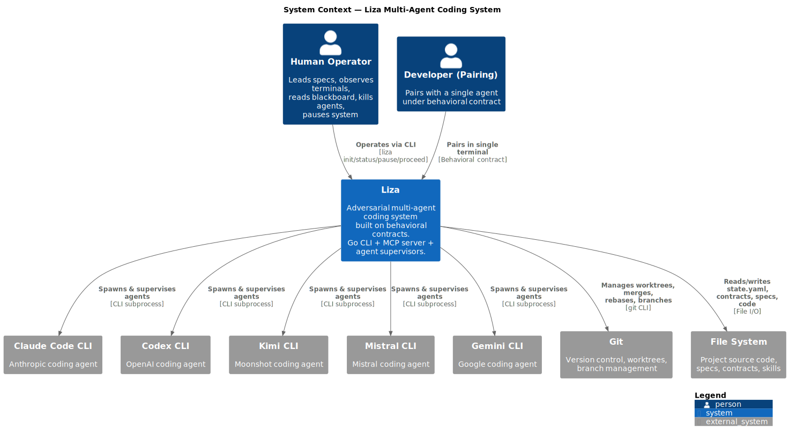
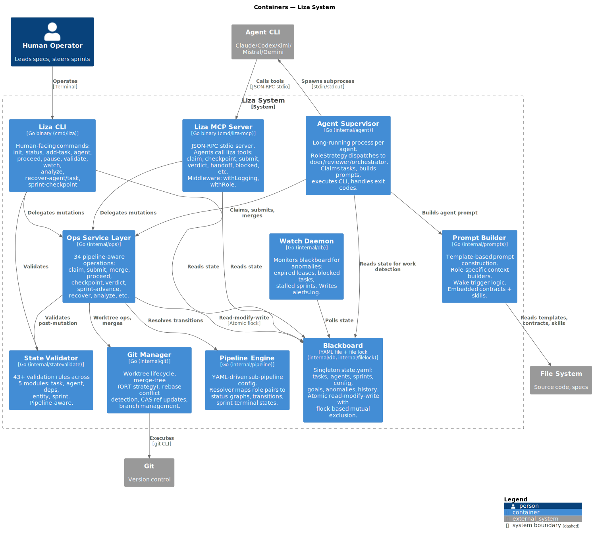
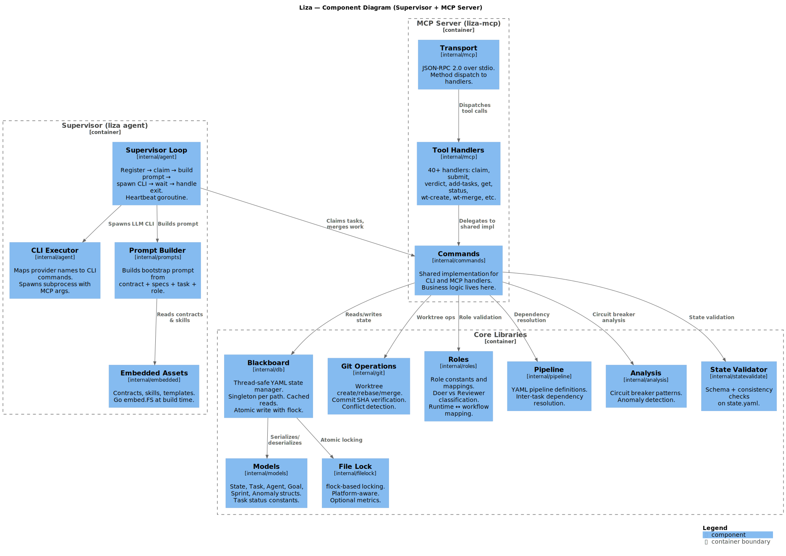
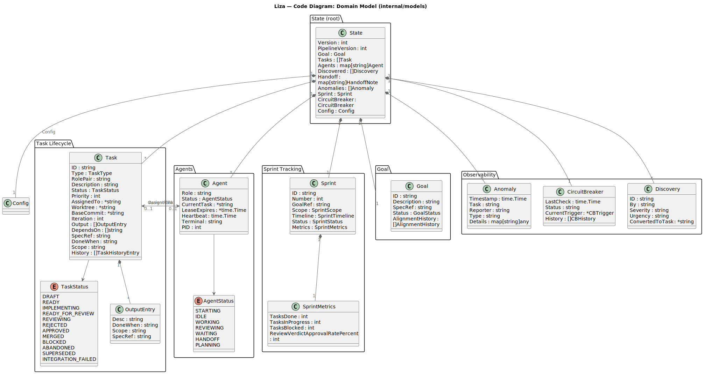
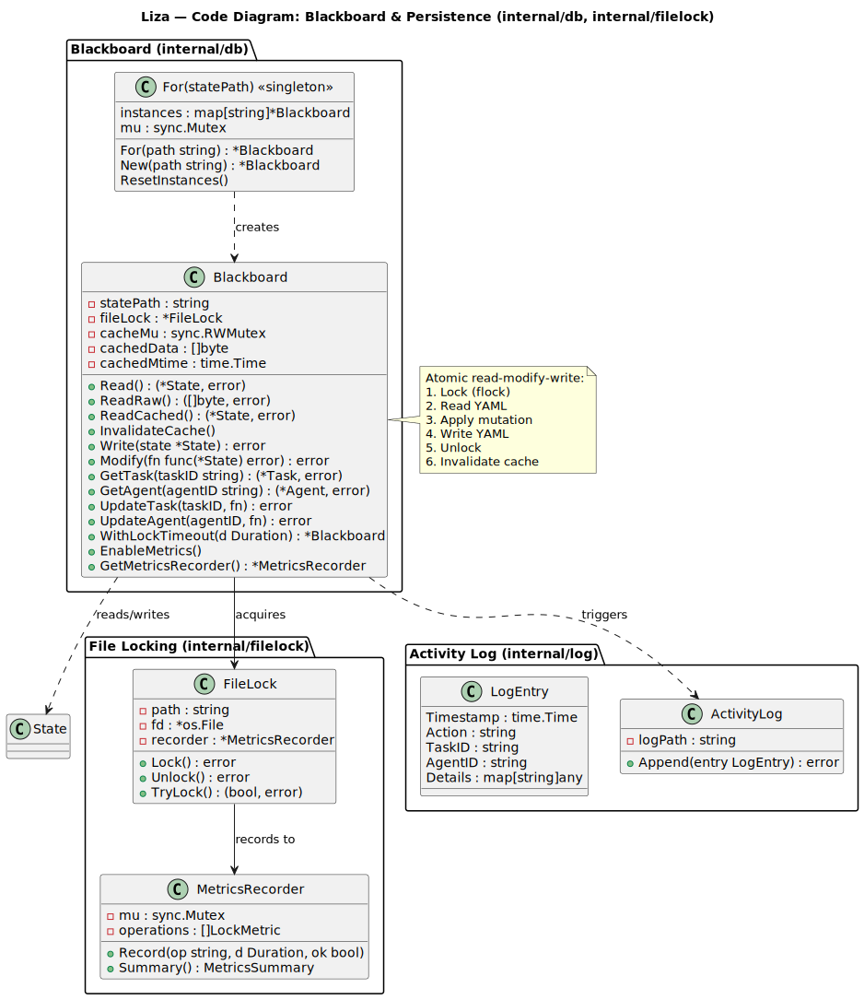
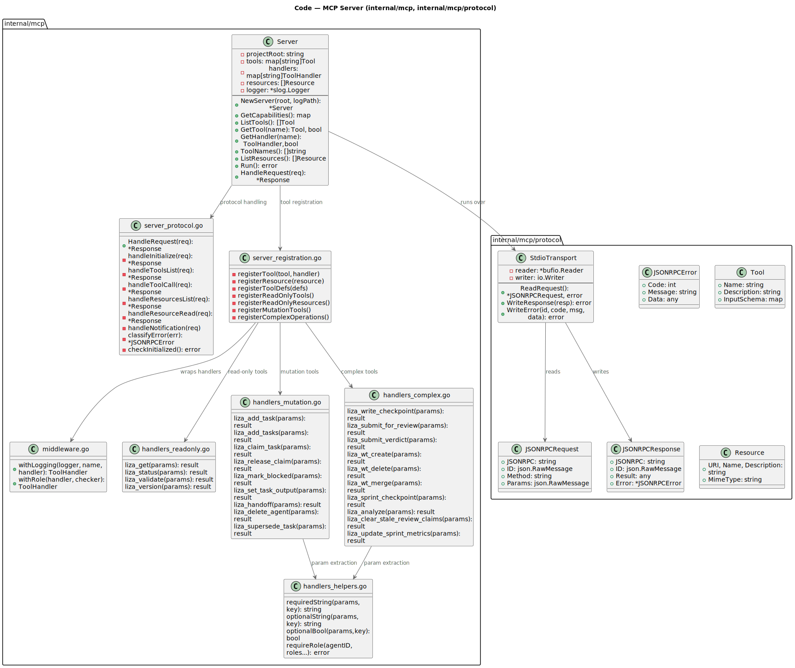
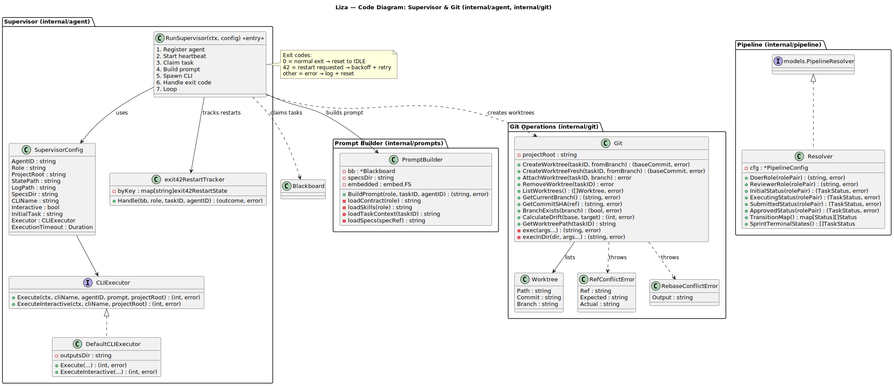

# Liza — C4 Architecture Diagrams

Created automatically by Claude Opus 4.6 via https://github.com/antoinebou12/uml-mcp

## Level 1: System Context

## Level 2: Containers

## Level 3: Components (Supervisor + MCP Server)

## Level 4: Code

### 4a — Domain Model (internal/models)

### 4b — Blackboard & Persistence (internal/db, internal/filelock)

### 4c — MCP Server (internal/mcp)

### 4d — Supervisor & Git (internal/agent, internal/git)

