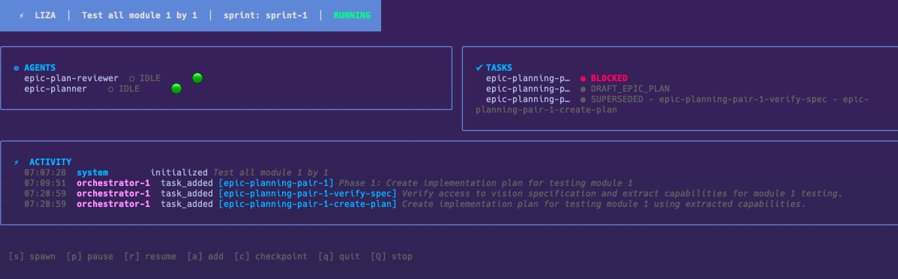

# New Console



> **Note:** The mockup above shows a two-column layout (agents left, tasks right) with compact panels. The final design uses a single-column layout with full-width tables for both agents and tasks, preserving all columns from `console.sh` via progressive disclosure based on terminal width. See [Layout](#layout) for the revised structure.

## Context

The current monitoring surface is `console.sh` invoked via `watch -n 2 './console.sh'`. It shells out to `liza status`, `liza get tasks`, `liza get agents`, `liza get metrics`, `liza get anomalies`, and parses `log.yaml` via `yq` — spawning 5+ subprocesses per refresh.

Problems:
- **No interactivity** — read-only terminal dump, operators must switch to another terminal to act
- **Subprocess overhead** — each 2s refresh opens/locks/reads `state.yaml` multiple times
- **No anomaly integration** — anomaly monitoring runs separately as `liza tui`, requiring a second terminal
- **Fixed-width** — hardcoded column widths (38/34/20), no terminal adaptation
- **No color** — black-and-white output, status differentiation relies on text alone

## Objective

Replace `console.sh` and the current headless `liza tui` with a single interactive TUI under the `liza tui` command. The TUI:
- Renders a live dashboard with color-coded status indicators
- Accepts keyboard commands to operate the system (spawn, pause, resume, add task, checkpoint, stop)
- Runs the existing anomaly checks inline, surfacing alerts in the activity feed
- Reacts to state changes via fsnotify (no polling-only refresh)

`--headless` flag preserves current `liza tui` behavior (anomaly alerts to stderr + `alerts.log`) for CI/cron use.

## Stack

- **Bubbletea** (v1.3.6) — TUI framework (indirect dep via Huh; becomes direct when TUI imports it — `go mod tidy` promotes it)
- **Lipgloss** (v1.1.0) — terminal styling (already direct in `go.mod`)
- **Bubbles** (v0.21.1) — TUI components (indirect; promoted to direct like Bubbletea)
- **Huh** (v1.0.0) — interactive forms for complex input (already direct, used by init wizard)

No new external dependencies — only promotion of existing indirect deps to direct.

## Layout

### Header Bar

```
⚡  LIZA  |  {goal.description}  |  sprint: {sprint.id}  |  {STATUS}
```

Status colored per unified palette. Full-width, background-colored bar.

### Unified Status Color Palette

A single color system applies to both agent and task statuses, so that an agent's color matches the task phase it's working on.

| Semantic group | Color | Agent statuses | Task patterns | System status |
|----------------|-------|----------------|---------------|---------------|
| Active work | Cyan | WORKING | `IMPLEMENTING_*` | RUNNING |
| Planning/draft | Yellow | PLANNING, STARTING | `DRAFT_*` (qualified), `*_PLANNING` | PAUSED |
| Review | Blue | REVIEWING | `REVIEWING_*`, `*_TO_REVIEW`, `*_READY_FOR_REVIEW` | — |
| Idle/waiting | Gray (hollow ○) | IDLE, WAITING | — | — |
| Handoff | Magenta | HANDOFF | — | CHECKPOINT |
| Approved/done | Green | — | `*_APPROVED`, `MERGED` (dim) | — |
| Partially done | Green dim | — | `*_PARTIALLY_APPROVED` | — |
| Rejected/blocked | Red | — | `BLOCKED`, `*_REJECTED`, `INTEGRATION_FAILED` (bold) | STOPPED |
| Terminal/inactive | Gray | — | `ABANDONED`, `SUPERSEDED` | — |
| Bare draft | Dim white | — | `DRAFT` (unqualified) | — |
| Fallback | White | — | Any unrecognized status | — |

Task status matching order: exact match first, then suffix, then prefix, then fallback. This ensures pipeline-configurable statuses (DRAFT_EPIC_PLAN, REVIEWING_US, etc.) render correctly without TUI changes.

### Agent Panel (full-width, table)

```
● AGENTS
  ID                       ROLE              STATUS     PID      CURRENT_TASK                                TIME_ON_TASK  HEARTBEAT
  code-plan-reviewer-1     code-plan-review  ○ IDLE     641568   —                                           —             25m ago
  code-reviewer-1          code-reviewer     ● REVIEW   624415   code-planning-1-code-plan-to-coding-1       11m           39s ago
  coder-2                  coder             ● WORKING  624502   code-planning-1-code-plan-to-coding-4       11m           13s ago
  orchestrator-1           orchestrator      ○ IDLE     623365   —                                           —             1m ago
```

Full-width table with columns adapted to terminal width:

| Priority | Columns | Min width |
|----------|---------|-----------|
| Always | ID, STATUS (dot + text) | 40 |
| ≥ 80 cols | + ROLE, CURRENT_TASK | 80 |
| ≥ 120 cols | + TIME_ON_TASK, HEARTBEAT | 120 |
| ≥ 160 cols | + PID, CONTEXT | 160 |

Agent status dots use colors from the unified palette above. Filled ● for active statuses, hollow ○ for idle/waiting.

Bordered panel, full-width.

### Task Panel (full-width, table)

```
✔ TASKS                                                                    3/5 done │ 1 blocked │ 72% approval
  ID                           STATUS              ATT   ASSIGNED_TO     AGE     DESCRIPTION
  code-planning-1              MERGED              1.2   coder-1         2d 21h  Phase 1: Spec alignment — update Vision…
  code-planning-2              BLOCKED             1.4   coder-1         2d 21h  Phase 2: Core model & attempt transition…
  epic-planning-pair-1         IMPLEMENTING_CODE   1.1   epic-planner    13m     Phase 1: Create implementation plan…
```

Full-width table with columns adapted to terminal width:

| Priority | Columns | Min width |
|----------|---------|-----------|
| Always | ID, STATUS (color-coded dot + text) | 60 |
| ≥ 80 cols | + ATTEMPT, ASSIGNED_TO | 80 |
| ≥ 120 cols | + AGE, DESCRIPTION (truncated) | 120 |
| ≥ 160 cols | + REVIEWING_BY, DEPS, TIME_IN_STATUS | 160 |

Panel header includes sprint metrics inline: `{done}/{total} done │ {blocked} blocked │ {approval_rate}% approval` (from `Sprint.Metrics`).

Task status colors use the unified palette above, matched by pattern (exact → suffix → prefix → fallback).

Bordered panel, full-width. Terminal tasks (MERGED, ABANDONED, SUPERSEDED) shown dimmed at bottom.

### Activity Panel (bottom)

```
⚡ ACTIVITY
  07:07:28  system          initialized   Test all module 1 by 1
  07:09:51  orchestrator-1  task_added    [epic-planning-pair-1] Phase 1: Create implementation plan…
  07:20:59  orchestrator-1  task_added    [epic-planning-pair-1-verify-spec] Verify access to vision…
```

Merged chronological feed from three sources:
1. **Log events** from `log.yaml` — format: `HH:MM:SS  {agent}  {action}  [{task}]  {detail}`
2. **Anomaly alerts** from watch checks — format: `HH:MM:SS  ⚠️/🚨  {category}: {message}`
3. **Blackboard anomalies** from `state.anomalies[]` — format: `HH:MM:SS  ⚠️  {reporter}: {type} [{task}]  {details}`

Auto-scrolls to bottom. Keeps last 200 entries in memory. Bordered panel, full-width.

### Alert Banner (transient)

Critical anomalies (`🚨`) display as a highlighted bar below the header:

```
🚨 CIRCUIT BREAKER: escalated to WARNING — 3 anomalies in 5 minutes
```

Auto-dismisses after 10 seconds or on any keypress. Only one banner visible at a time (latest wins).

### Footer Bar

```
[s] spawn  [p] pause  [r] resume  [a] add  [c] checkpoint  [y] yolo  [?] help  [q] quit  [Q] stop
```

Full-width. Context-sensitive — transforms during input mode (see Input Mode).

## Adaptive Layout

All panels are full-width. Vertical stacking: Header → Alert banner → Agent panel → Task panel → Activity → Footer.

Both agent and task panels adapt visible columns to terminal width (see column priority tables above). Below 80 columns, IDs truncate and secondary columns are hidden.

Minimum terminal: 80×24. Terminal resize handled via Bubbletea's `tea.WindowSizeMsg` — recalculates column visibility and re-renders.

## Data Sources & Refresh

### Primary: fsnotify (reactive)

Subscribe to `Blackboard.WatchForChanges()` (`internal/db/watcher.go`). The watcher:
- Monitors the `.liza/` directory (handles atomic renames)
- Debounces at 50ms
- Sends on `Events()` channel

On each event: re-read `state.yaml` via `Blackboard.Read()`, update model, re-render.

### Secondary: 10s poll tick

A `tea.Tick` at 10-second intervals:
- Runs all 13 anomaly checks from `watch.go:runChecks()` against current state
- Serves as fsnotify fallback (catches missed events)
- Updates heartbeat age displays

### Activity feed: log.yaml

Read `log.yaml` on each state change notification. The directory watcher filters events to `statePath` only (`watcher.go:75`), so log.yaml changes do not produce their own notifications. This works because log writes accompany state changes in practice, and the 10s poll tick catches any stragglers. Track last-read position to append only new entries.

### State cache

The `WatchConfig.StateCache` (used by anomaly checks for alert throttling) lives in the TUI model as persistent state across ticks, identical to current `WatchCommand` behavior.

## Keybindings

| Key | Action | Input | Implementation |
|-----|--------|-------|----------------|
| `s` | Spawn agent | Role (inline input with tab-completion) | `exec.Command("liza", "agent", role).Start()` (background process) |
| `p` | Pause system | Optional reason (inline input) | `commands.PauseCommand()` direct call |
| `r` | Resume system | None | `commands.ResumeCommand()` direct call |
| `a` | Add task | Huh form (see below) | `commands.AddTaskCommand()` direct call |
| `c` | Sprint checkpoint | None | `commands.SprintCheckpointCommand()` direct call |
| `y` | Toggle auto-resume | None | `Blackboard.Modify()` toggles `config.auto_resume`; shows "Auto-resume: ON/OFF" on status line |
| `q` | Quit TUI | None | `tea.Quit` (system continues running) |
| `Q` | Stop system | `y/n` confirmation | `commands.StopCommand()` then `tea.Quit` |
| `?` | Toggle help overlay | None | Show/hide full keybinding reference |

### Command integration

State-modifying actions call `commands.*Command()` functions directly (same Go process, no subprocess overhead). This gives instant feedback and proper error handling.

**Exception:** Spawn (`s`) must use `exec.Command().Start()` because the agent is a long-running process that needs its own PTY. The TUI detaches the child process.

Command results (success or error) display as a transient status message in the footer area, visible for 3 seconds.

## Input Mode

Two-tier input design:

### Tier 1: Inline prompt (simple inputs)

For spawn role and pause reason. Footer transforms:

```
Role: epic-planner█                              [Tab] complete  [Enter] confirm  [Esc] cancel
```

- `Tab` cycles through valid completions (roles from pipeline config)
- `Enter` confirms and executes
- `Esc` cancels, returns to normal footer

Uses Bubbles `textinput` component.

### Tier 2: Huh form overlay (complex inputs)

For add-task. Renders a Huh form over the activity panel:

Fields:

| Field | Type | Required | Notes |
|-------|------|----------|-------|
| ID | Text input | Yes | Kebab-case, validated |
| Description | Text input | Yes | Free text |
| Spec ref | Text input | No | Path to spec file |
| Done when | Text input | No | Acceptance criteria |
| Depends on | Multi-select | No | List existing task IDs |
| Priority | Select | No | Default: 0 |

`Enter` submits, `Esc` cancels. Huh composes into Bubbletea natively (already proven in init wizard at `internal/interactive/init_wizard.go`).

## Anomaly Monitoring

All 13 checks from `watch.go:runChecks()` run on the 10s poll tick:

| Check | Alert level |
|-------|------------|
| Expired leases | ⚠️ |
| Blocked tasks | ⚠️ |
| Orphaned rejected tasks | ⚠️ |
| Review loops (≥5 cycles) | ⚠️ |
| Integration failures | 🚨 |
| Hypothesis exhaustion (≥2 failures) | 🚨 |
| Reassigned tasks (attempt 2) | ⚠️ |
| Approaching limits (8/10 iter, 3/5 review) | ⚠️ |
| Stale sentinels (>2min) | ⚠️ |
| Stalled progress (>30min) | ⚠️ |
| Stale drafts (>30min) | ⚠️ |
| Immediate discoveries | ⚠️ |
| Missing roles | ⚠️ |

Plus circuit breaker escalation, sprint stalled, and state validity checks (all 🚨).

**Display:**
- Warning alerts (⚠️) → activity feed only
- Critical alerts (🚨) → activity feed + alert banner

Alerts are written to `alerts.log` in parallel (same as current behavior) for audit trail.

## Migration

1. `liza tui` becomes the interactive TUI (`watch` retained as alias)
2. `liza tui --headless` preserves current behavior (anomaly alerts to stderr + `alerts.log`, no TUI)
3. `console.sh` deprecated — print notice on execution pointing to `liza tui`
4. Next release: remove `console.sh` from embedded assets and `liza init` output

## Architecture

New package: `internal/tui/`

```
internal/tui/
├── model.go      — main Bubbletea model (state, panels, input mode, alert cache)
├── update.go     — message handling (keys, ticks, state refresh, window resize)
├── view.go       — rendering (header, panels, footer, alert banner, help overlay)
├── styles.go     — Lipgloss style definitions (colors, borders, layout)
├── commands.go   — Bubbletea Cmd functions (read state, run checks, exec actions)
└── keymap.go     — key binding definitions
```

Integration point: `cmd/liza/cmd_system.go` — modify existing `watchCmd` to launch Bubbletea program (default) or headless mode (`--headless` flag).

## Phase 2 (future, not in scope)

- **Panel navigation**: `Tab` to cycle focus, `j`/`k` to navigate within focused panel
- **Item selection**: `Enter` to show detail pane for selected task/agent
- **Agent management**: `d` to delete selected agent (with confirm)
- **Log filtering**: `/` to search activity feed
- **Mouse support**: Click to select panels/items
